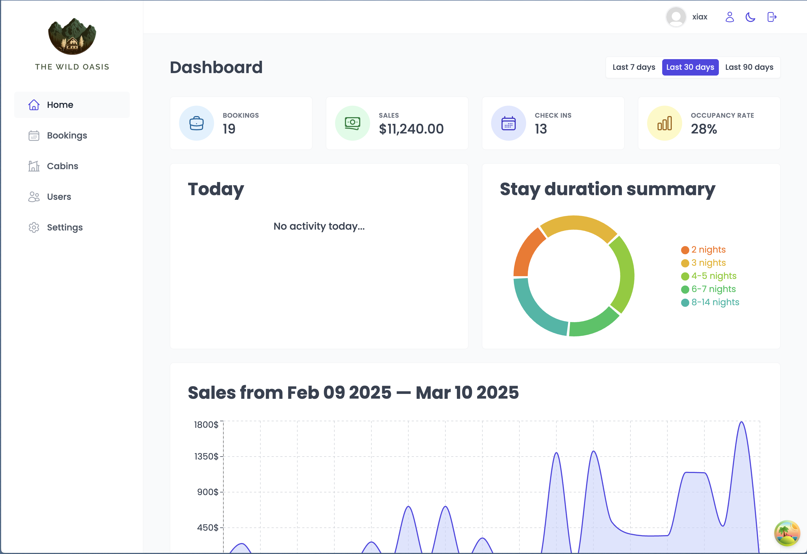

# 🌿 The Wild Oasis 度假村管理系统

**全栈管理系统** | 多角色权限控制 | 响应式仪表盘 | 实时数据可视化

[](https://react.dev/)
[](https://nodejs.org/)
[](https://opensource.org/licenses/MIT)

 `<!-- 添加实际截图路径 -->`

## 🚀 核心功能

### **多角色用户系统**

- **住客**：预订管理、个人信息更新
- **员工**：客房管理、入住办理、订单审核
- **管理员**：全局数据分析、用户权限管理、系统设置

### **特色模块**

- **实时仪表盘**：可视化展示入住率、营收趋势、近期活动
- **智能预订系统**：客房状态实时更新 + 冲突检测
- **快速入住/退房**：扫码登记 + 电子账单自动生成
- **动态主题系统**：支持浅色/深色模式一键切换
- **响应式设计**：完美适配桌面/平板/移动端

## 🛠️ 技术栈

### **前端**

| 技术              | 用途                      |
| ----------------- | ------------------------- |
| React 18          | 组件化开发 + 状态管理     |
| React Query       | 服务端状态缓存与同步      |
| styled-components | CSS-in-JS 主题化解决方案  |
| React Hook Form   | 高性能表单管理与验证      |
| Context API       | 全局状态共享（用户/主题） |

### **后端**

| 技术             | 用途                     |
| ---------------- | ------------------------ |
| Node.js/Express  | RESTful API 开发         |
| MongoDB/Mongoose | 数据存储与建模           |
| JWT              | 用户认证与安全会话管理   |
| Multer           | 文件上传（客房图片管理） |

## 📂 项目结构

```text
the-wild-oasis/
├── frontend/                 # 前端源码
│   ├── src/features/         # 功能模块 (认证/预订/客房)
│   ├── src/ui/               # 可复用组件库 (60+ 组件)
│   └── src/hooks/            # 自定义 Hooks (数据获取/事件监听)
│
├── backend/                  # 后端源码
│   ├── controllers/          # API 业务逻辑
│   ├── models/               # MongoDB 数据模型
│   └── utils/                # 工具类 (错误处理/文件上传)
└──
```

## 🛠️ 本地运行

### **前置条件**

- Node.js ≥18.x
- MongoDB ≥6.x

### **1. 克隆仓库**

```bash
git clone https://github.com/your-username/the-wild-oasis.git
cd the-wild-oasis
```

### **2. 启动后端服务**

```bash
cd the-wild-oasis_backend
cp config.env.example config.env  # 填写实际配置
npm install
npm start
```

### **3. 启动前端应用**

```bash
cd the-wild-oasis_frontend
npm install
npm run dev
```

## 🌐 部署指南

**推荐方案** ：Vercel (前端) + Render (后端) + MongoDB Atlas
https://vercel.com/button

```bash
# 生产环境变量示例
VITE_API_URL=https://your-api-domain.com
VITE_MAPBOX_TOKEN=your_token_here
```

## 🤝 贡献指南

1. Fork 项目仓库
2. 创建特性分支 (`git checkout -b feature/amazing-feature`)
3. 提交更改 (`git commit -m 'Add some feature'`)
4. 推送到分支 (`git push origin feature/amazing-feature`)
5. 发起 Pull Request

## 📄 许可证

本项目采用 **MIT License**
